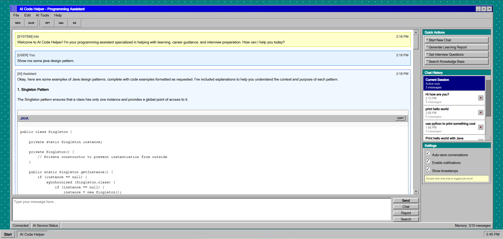

# 🤖 AI Code Helper

> **A retro-styled AI programming assistant with modern capabilities**

[](https://www.oracle.com/java/)
[](https://spring.io/projects/spring-boot)
[](https://www.typescriptlang.org/)
[](https://github.com/langchain4j/langchain4j)
[](LICENSE)

A comprehensive AI-powered programming assistant that combines the nostalgic charm of Windows 95 UI with cutting-edge AI capabilities. Built with Spring Boot and LangChain4j, featuring real-time streaming responses, RAG implementation, and advanced conversation management.

<div align="center">
  
  <br>
  <em>Classic Windows 95 interface with modern AI capabilities</em>
</div>

## 🎯 Features

### 🤖 **AI Capabilities**
- **Multi-Modal AI Assistant** powered by Google Gemini 2.0 Flash Experimental
- **Real-time Streaming** responses via Server-Sent Events
- **RAG (Retrieval Augmented Generation)** with curated knowledge base
- **Conversation Memory** management across sessions
- **Structured Output Generation** for learning reports
- **MCP (Model Context Protocol)** integration for web search

### 💻 **Programming Assistant**
- **Intelligent Code Explanations** with syntax highlighting
- **Debug Support** with step-by-step guidance
- **Best Practices** recommendations
- **Architecture Design** assistance
- **Code Review** and optimization suggestions

### 🎓 **Learning & Career Development**
- **Personalized Learning Roadmaps** based on skill level
- **Interview Question Database** with current industry questions
- **Project-Based Learning** recommendations
- **Career Guidance** and resume optimization
- **Progress Tracking** and milestone management

### 🎨 **Authentic Windows 95 UI**
- **Pixel-perfect Windows 95 styling** with authentic borders and colors
- **Classic window controls** (minimize, maximize, close)
- **Retro taskbar** with start button and system tray
- **3D beveled elements** and classic button styles
- **Authentic scrollbars** with arrow buttons
- **MS Sans Serif** typography throughout

### 🔧 **Advanced Features**
- **Smart Auto-scrolling** during AI generation
- **Code Block Copy** functionality with Windows 95 styling
- **Session Management** with chat history
- **Input Safety Guardrails** for content filtering
- **CORS Support** for cross-origin requests
- **Environment-based Configuration**

## 🚀 Quick Start

### Prerequisites

- **Java 21+** ([Download](https://adoptium.net/))
- **Node.js 18+** ([Download](https://nodejs.org/))
- **Google AI Gemini API Key** ([Get yours](https://aistudio.google.com/app/apikey))

### 1. Clone the Repository

```bash
git clone https://github.com/yourusername/ai-code-helper.git
cd ai-code-helper
```

### 2. Configure API Keys

Create a `.env` file in the project root:

```env
# Google AI Gemini API Key (Required)
GOOGLE_AI_GEMINI_API_KEY=your_gemini_api_key_here

# BigModel API Key (Optional - for web search)
BIGMODEL_API_KEY=your_bigmodel_api_key_here
```

### 3. Run the Application

#### Option A: Using the Management Script (Recommended)
```bash
# Windows
./ai-helper.bat

# Follow the interactive menu:
# 1. Setup API Keys (first time only)
# 2. Start Full Application
```

#### Option B: Manual Setup
```bash
# Backend (Terminal 1)
mvn spring-boot:run

# Frontend (Terminal 2)
cd ai-code-helper-frontend
npm install
npm run dev
```

### 4. Access the Application

- **Frontend**: http://localhost:5173
- **Backend API**: http://localhost:8081/api

## 📁 Project Structure

```
ai-code-helper/
├── src/main/java/com/aicodehelper/
│   ├── ai/                          # AI service implementations
│   │   ├── model/                   # AI model configurations
│   │   ├── guardrail/              # Safety and input validation
│   │   ├── rag/                    # Knowledge base and RAG
│   │   ├── tools/                  # Interview questions tool
│   │   └── mcp/                    # Web search integration
│   ├── controller/                 # REST API endpoints
│   └── config/                     # Application configuration
├── src/main/resources/
│   ├── docs/                       # Knowledge base documents
│   ├── application.yml             # Main configuration
│   └── system-prompt.txt           # AI personality and instructions
├── ai-code-helper-frontend/
│   ├── src/
│   │   ├── api/                    # Backend API client
│   │   ├── components/             # UI components
│   │   ├── styles/                 # Windows 95 CSS
│   │   ├── types/                  # TypeScript interfaces
│   │   └── utils/                  # Helper utilities
│   └── package.json                # Frontend dependencies
├── ai-helper.bat                   # Management script
└── README.md                       # This file
```

## 🛠️ Technology Stack

### Backend
- **[Spring Boot 3.5.3](https://spring.io/projects/spring-boot)** - Enterprise Java framework
- **[LangChain4j 1.2.0](https://github.com/langchain4j/langchain4j)** - Java AI framework
- **[Google AI Gemini](https://ai.google.dev/)** - Large language model
- **[Spring WebFlux](https://docs.spring.io/spring-framework/docs/current/reference/html/web-reactive.html)** - Reactive web framework
- **[Maven](https://maven.apache.org/)** - Build and dependency management
- **[Lombok](https://projectlombok.org/)** - Boilerplate reduction

### Frontend
- **[TypeScript 5.3.3](https://www.typescriptlang.org/)** - Type-safe JavaScript
- **[Vite 5.0.10](https://vitejs.dev/)** - Fast build tool and dev server
- **Vanilla TypeScript** - No framework overhead for authentic feel
- **CSS3** - Windows 95 authentic styling
- **Server-Sent Events** - Real-time streaming communication

### AI & Integration
- **Google AI Gemini 2.0 Flash Experimental** - Primary language model
- **RAG (Retrieval Augmented Generation)** - Knowledge base integration
- **MCP (Model Context Protocol)** - Web search capabilities
- **Vector Embeddings** - Document similarity search

## 🔧 Configuration

### Environment Variables

| Variable | Required | Description |
|----------|----------|-------------|
| `GOOGLE_AI_GEMINI_API_KEY` | ✅ | Your Google AI Gemini API key |
| `BIGMODEL_API_KEY` | ❌ | Optional: BigModel API for web search |

### Application Configuration

Key configuration options in `src/main/resources/application.yml`:

```yaml
# AI Model Configuration
google-ai:
  model-name: gemini-2.0-flash-exp
  temperature: 0.7
  max-tokens: 2000

# Memory Management
ai:
  chat:
    memory:
      max-messages: 10
  
# RAG Configuration
  rag:
    document-path: "src/main/resources/docs"
    chunk-size: 1000
    chunk-overlap: 200
    max-results: 5
    min-score: 0.75
```

## 🎮 Usage Examples

### Basic Chat
```typescript
// Ask programming questions
"How do I implement a binary search in Java?"

// Get debugging help
"Why is my React component not re-rendering?"

// Architecture advice
"What's the best design pattern for this scenario?"
```

### Learning Reports
```typescript
// Request personalized learning path
"Create a learning roadmap for full-stack development"

// Get career guidance
"How can I prepare for senior developer interviews?"
```

### Knowledge Base Queries
```typescript
// Search curated programming knowledge
"What are SOLID principles in software design?"

// Get best practices
"Microservices deployment strategies"
```

## 🔒 Security Features

- **Input Guardrails**: Filters inappropriate content before AI processing
- **CORS Protection**: Configurable cross-origin request handling
- **Environment Variables**: Secure API key management
- **Input Validation**: Server-side request validation
- **Rate Limiting**: Built-in Spring Boot protections

## 🧪 Testing

### Run Backend Tests
```bash
mvn test
```

### Run Frontend Tests
```bash
cd ai-code-helper-frontend
npm test
```

### Test Coverage
- Unit tests for AI service components
- Integration tests for API endpoints
- Frontend component testing
- RAG and memory management tests

## 📚 API Documentation

### Core Endpoints

| Endpoint | Method | Description |
|----------|--------|-------------|
| `/api/ai/chat/stream` | GET | Real-time streaming chat |
| `/api/ai/chat` | POST | Standard chat response |
| `/api/ai/learning-report` | POST | Generate learning report |
| `/api/ai/chat/knowledge` | POST | Knowledge base search |
| `/api/ai/interview-questions` | GET | Get interview questions |

### Example API Usage

```javascript
// Streaming chat
const response = await fetch('/api/ai/chat/stream?message=Hello&memoryId=1', {
  headers: { 'Accept': 'text/event-stream' }
});

// Standard chat
const result = await fetch('/api/ai/chat', {
  method: 'POST',
  headers: { 'Content-Type': 'application/json' },
  body: JSON.stringify({ message: 'Explain recursion' })
});
```

## 🤝 Contributing

We welcome contributions! 

### Development Setup

1. **Fork the repository**
2. **Create a feature branch**: `git checkout -b feature/amazing-feature`
3. **Make your changes**
4. **Run tests**: `mvn test && cd ai-code-helper-frontend && npm test`
5. **Commit your changes**: `git commit -m 'Add amazing feature'`
6. **Push to the branch**: `git push origin feature/amazing-feature`
7. **Open a Pull Request**

### Code Style

- **Backend**: Follow Java conventions with Lombok annotations
- **Frontend**: Use TypeScript with explicit typing
- **CSS**: Maintain Windows 95 authentic styling patterns
- **Documentation**: Update README for new features

## 📄 License

This project is licensed under the MIT License - see the [LICENSE](LICENSE) file for details.

## 🙏 Acknowledgments

- **[LangChain4j](https://github.com/langchain4j/langchain4j)** - Excellent Java AI framework
- **[Google AI](https://ai.google.dev/)** - Powerful Gemini language models
- **[Spring Boot](https://spring.io/projects/spring-boot)** - Robust application framework
- **Windows 95** - For the iconic UI inspiration


---

<div align="center">


*Bringing retro vibes to modern AI development*

</div>
